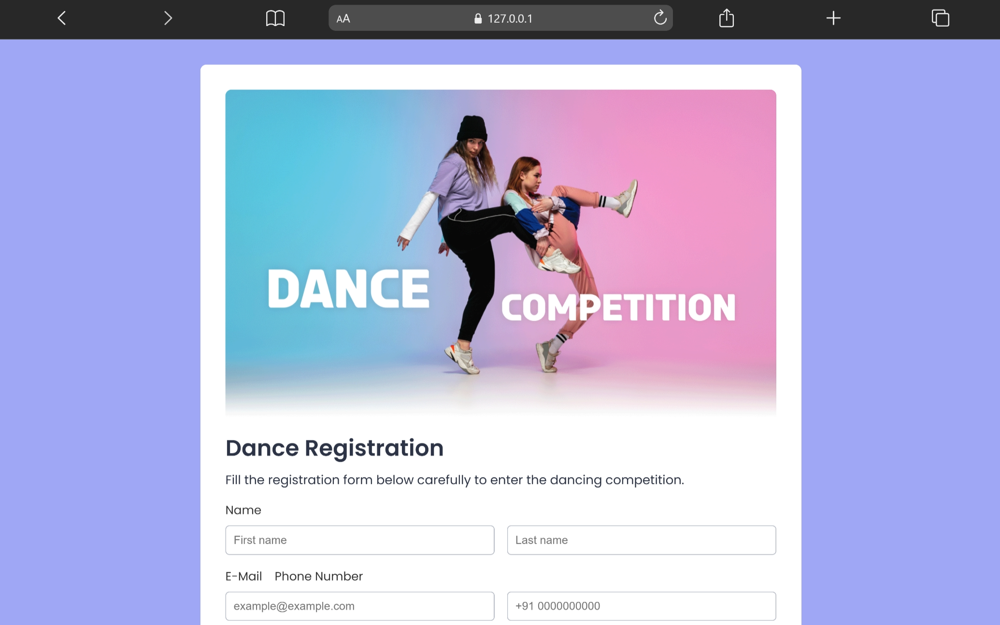

# Registration Form

A modern and responsive registration form built using HTML and CSS.

This project focuses on clean form design, responsive layouts, and structured frontend styling practices.

---

## 🚀 Live Demo

[View Project](https://aniruddha-jadhav-15.github.io/frontend-mini-projects/project-03-Registration-Form/)

---

## 📸 Preview



---

## ✨ Features

- Responsive form layout
- Styled input fields
- Clean UI design
- User-friendly structure
- Modern typography

---

## 🛠️ Technologies Used

- HTML5
- CSS3

---

## 📁 Folder Structure

```bash
project-03-Registration-Form/
│
├── img/
├── index.html
├── style.css
└── README.md
```

---

## 📥 Clone Repository

```bash
git clone https://github.com/aniruddha-jadhav-15/frontend-mini-projects.git
```

---

## ▶️ Run Locally

1. Clone the repository
2. Open the project folder
3. Run `index.html` in your browser

---

## 📌 Future Improvements

- Add form validation
- Improve accessibility
- Add password visibility toggle
- Enhance responsiveness

---

## 👨‍💻 Author

Aniruddha Jadhav

Frontend Developer & Continuous Learner
