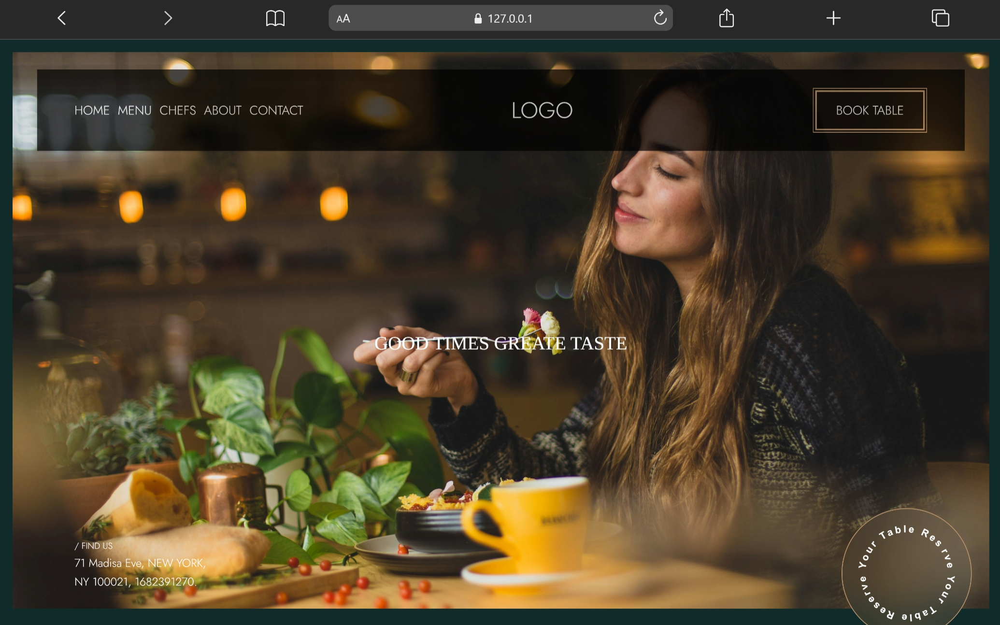

# Restaurant Landing Page

A responsive restaurant landing page built using HTML and CSS.

This project focuses on creating a modern restaurant website layout with clean UI sections, responsive design, and visually appealing styling.

---

## 🚀 Live Demo

[View Project](https://aniruddha-jadhav-15.github.io/frontend-mini-projects/project-04-Restaurant-Landing-page/)

---

## 📸 Preview



---

## ✨ Features

- Responsive landing page
- Hero section design
- Modern UI layout
- Clean typography
- Organized page structure

---

## 🛠️ Technologies Used

- HTML5
- CSS3

---

## 📁 Folder Structure

```bash
project-04-Restaurant-Landing-page/
│
├── images/
├── index.html
├── style.css
└── README.md
```

---

## 📥 Clone Repository

```bash
git clone https://github.com/aniruddha-jadhav-15/frontend-mini-projects.git
```

---

## ▶️ Run Locally

1. Clone the repository
2. Open the project folder
3. Run `index.html` in your browser

---

## 📌 Future Improvements

- Improve responsiveness
- Add menu interactions
- Enhance UI sections

---

## 👨‍💻 Author

Aniruddha Jadhav

Frontend Developer & Continuous Learner
