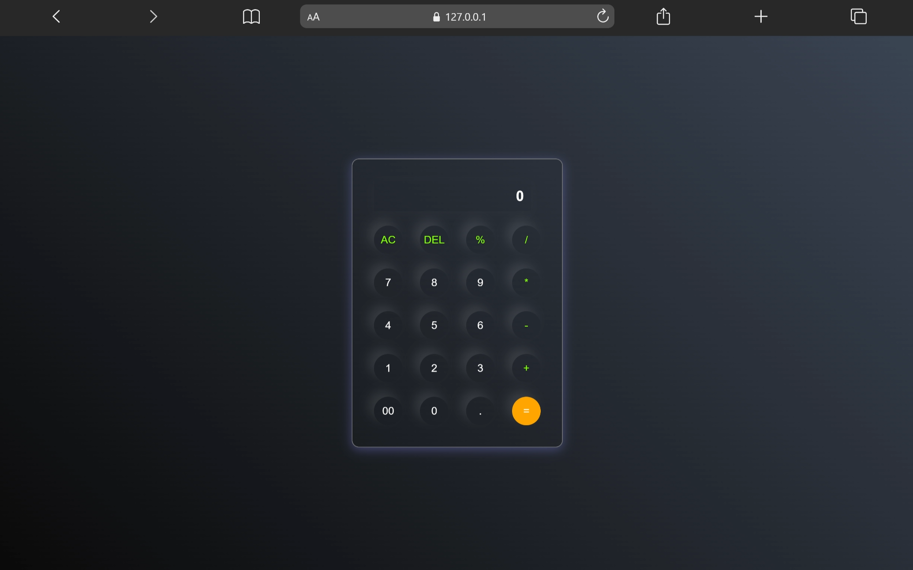

# Calculator

A simple and responsive calculator application built using HTML, CSS, and JavaScript.

This project focuses on JavaScript DOM manipulation, event handling, and interactive UI functionality.

---

## 🚀 Live Demo

[View Project](https://aniruddha-jadhav-15.github.io/frontend-mini-projects/project-05-Calculator/)

---

## 📸 Preview



---

## ✨ Features

- Basic arithmetic operations
- Interactive calculator buttons
- Responsive layout
- Clean UI design
- Real-time calculations

---

## 🛠️ Technologies Used

- HTML5
- CSS3
- JavaScript

---

## 📁 Folder Structure

```bash
project-05-Calculator/
│
├── index.html
├── style.css
├── script.js
└── README.md
```

---

## 📥 Clone Repository

```bash
git clone https://github.com/aniruddha-jadhav-15/frontend-mini-projects.git
```

---

## ▶️ Run Locally

1. Clone the repository
2. Open the project folder
3. Run `index.html` in your browser

---

## 📌 Future Improvements

- Add keyboard support
- Add scientific operations
- Improve animations
- Enhance UI design

---

## 👨‍💻 Author

Aniruddha Jadhav

Frontend Developer & Continuous Learner
