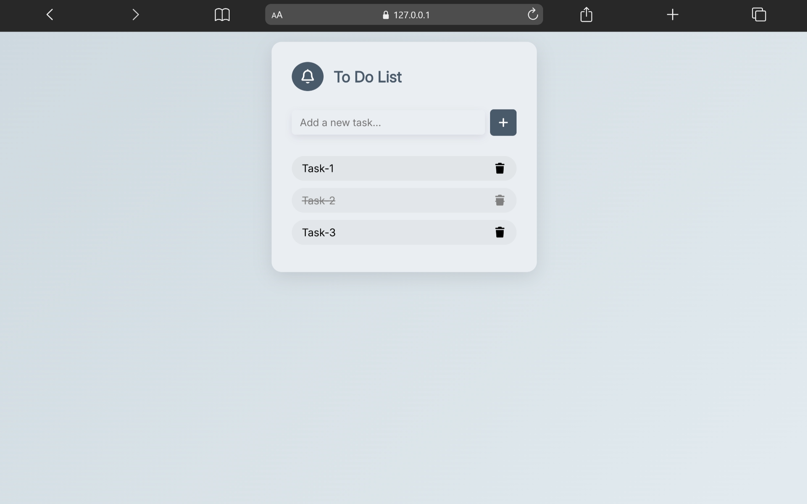

# To-Do List Web App

A responsive To-Do List application built using HTML, CSS, and JavaScript.

This project focuses on task management functionality, DOM manipulation, and interactive frontend development concepts.

---

## 🚀 Live Demo

[View Project](https://aniruddha-jadhav-15.github.io/frontend-mini-projects/project-08-To-Do-list-Web-App/)

---

## 📸 Preview



---

## ✨ Features

- Add tasks
- Delete tasks
- Mark tasks as completed
- Interactive UI
- Responsive design

---

## 🛠️ Technologies Used

- HTML5
- CSS3
- JavaScript

---

## 📁 Folder Structure

```bash
project-08-To-Do-list-Web-App/
│
├── img/
├── index.html
├── style.css
├── script.js
└── README.md
```

---

## 📥 Clone Repository

```bash
git clone https://github.com/aniruddha-jadhav-15/frontend-mini-projects.git
```

---

## ▶️ Run Locally

1. Clone the repository
2. Open the project folder
3. Run `index.html` in your browser

---

## 📌 Future Improvements

- Add local storage support
- Add task filtering
- Improve animations
- Add dark mode

---

## 👨‍💻 Author

Aniruddha Jadhav

Frontend Developer & Continuous Learner
