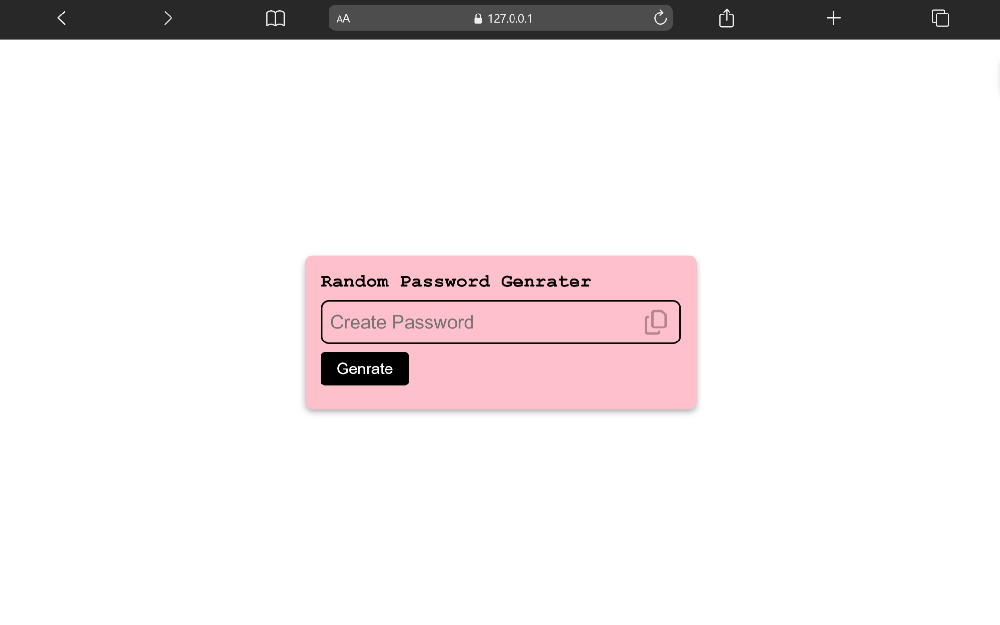

# Random Password Generator

A responsive password generator application built using HTML, CSS, and JavaScript.

This project demonstrates JavaScript logic, random password generation, and interactive UI functionality.

---

## 🚀 Live Demo

[View Project](https://aniruddha-jadhav-15.github.io/frontend-mini-projects/project-09-Random-Password-Genrater/)

---

## 📸 Preview



---

## ✨ Features

- Generate random passwords
- Interactive UI
- Responsive layout
- Clean design structure
- One-click password generation

---

## 🛠️ Technologies Used

- HTML5
- CSS3
- JavaScript

---

## 📁 Folder Structure

```bash
project-09-Random-Password-Genrater/
│
├── index.html
├── style.css
├── script.js
├── preview.png
└── README.md
```

---

## 📥 Clone Repository

```bash
git clone https://github.com/aniruddha-jadhav-15/frontend-mini-projects.git
```

---

## ▶️ Run Locally

1. Clone the repository
2. Open the project folder
3. Run `index.html` in your browser

---

## 📌 Future Improvements

- Add password strength indicator
- Add copy-to-clipboard feature
- Improve UI animations
- Add custom password settings

---

## 👨‍💻 Author

Aniruddha Jadhav

Frontend Developer & Continuous Learner
