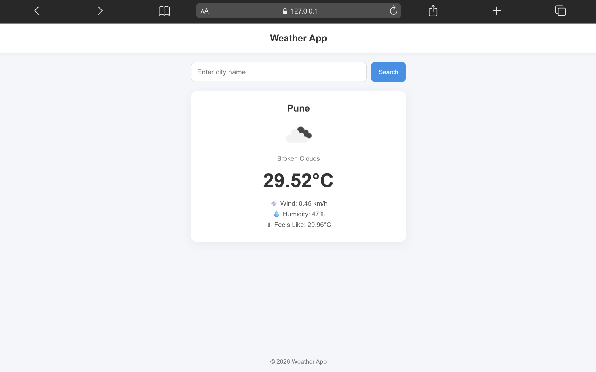

# Weather App

A responsive weather application built using HTML, CSS, and JavaScript.

This project demonstrates API integration, dynamic weather data fetching, and interactive frontend functionality using JavaScript.

---

## 🚀 Live Demo

[View Project](https://aniruddha-jadhav-15.github.io/frontend-mini-projects/project-10-Weather-App/)

---

## 📸 Preview



---

## ✨ Features

- Search weather by city
- Real-time weather updates
- Dynamic weather information
- Responsive UI design
- Clean and modern layout

---

## 🛠️ Technologies Used

- HTML5
- CSS3
- JavaScript
- Weather API

---

## 📁 Folder Structure

```bash id="szmjlwm"
project-10-Weather-App/
│
├── img/
├── index.html
├── style.css
├── script.js
└── README.md
```

---

## 📥 Clone Repository

```bash id="cfxv1y"
git clone https://github.com/aniruddha-jadhav-15/frontend-mini-projects.git
```

---

## ▶️ Run Locally

1. Clone the repository
2. Open the project folder
3. Run `index.html` in your browser

---

## 📌 Future Improvements

- Add 5-day weather forecast
- Add weather icons and animations
- Add dark mode support

---

## 👨‍💻 Author

Aniruddha Jadhav

Frontend Developer & Continuous Learner
